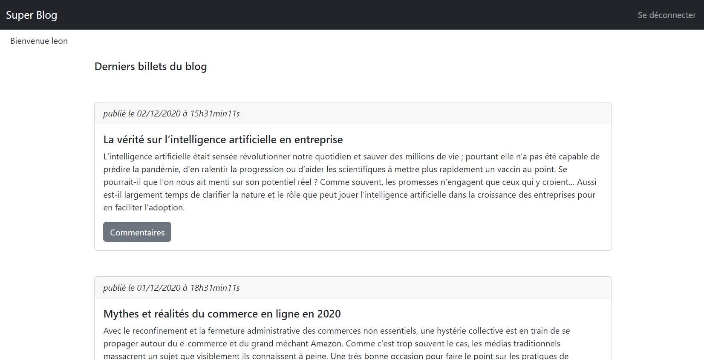
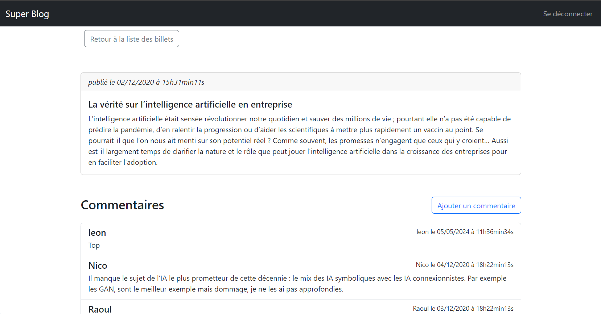

# SuperBlog

Ce blog permet de suivre différents articles et commentaires associés. Pour ajouter des commentaires, l'utilisateur doit se connecter à l'aide d'une authentification sécurisée par la librairie PHP Sodium qui permet de gérer les hachages et salage de mots de passe. Il a été développé en HTML/CSS et PHP avec MySQL comme SGBD. Le gestionnaire de versions décentralisé utilisé est Git.

## Fonctionnalités 

- Suivi des articles et commentaires associés
- Gestion des commentaires
- Authentification
- Inscription




Pour plus de captures d'écran, consultez le dossier `screenshots` dans le dossier racine du projet.

## Prérequis

- Serveur Apache 2.4
- PHP 8.1
- MySQL 8.0.23

## Installation

1. Clonez le dépôt sur votre serveur.
2. Lancer le serveur Apache.
3. Configurer la base de données.
    Importez le fichier `sql/superblog.sql` dans la base de données. Si elle se situe en distant, vous devez d'abord configurer un fichier `.env` à la racine du projet tel que :

    ```bash
    DB_HOST=exampledbhost
    DB_NAME=exampledbname
    DB_LOGIN=exampledblogin
    DB_PASSWORD=exampledbpassword
    ```
4. Ouvrez le navigateur et accédez à l'adresse où se trouve le projet au sein de votre serveur.

## Développement

- Visual Studio Code
- Wamp Server

## Auteur 

Beatriz Moura - Développement initial | @BeaMoura0906

Ce projet a été réalisé en cours de formation dans le cadre d'un BTS SIO option SLAM (1ère année).